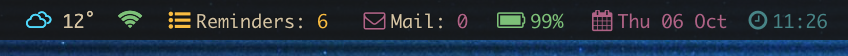
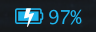
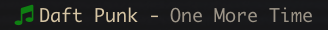

# Ubersicht-BetterBar-widget

The original is by [Herrbischoff](https://github.com/herrbischoff/nerdbar.widget) - Check it out!

This is my betterbar widget pack cobbled together from a lot of other widgets and lovingly assembled by me. It's made for [Übersicht](http://tracesof.net/uebersicht/) and displays a lot of information in a compact bar.

## Installation
Place "Betterbar-master" in the **Übersicht Widget Directory** or if you want to only install one or a few of the widgets, just remove them from "Betterbar-master" and put them in the Widget Directory.

This bar also pairs pretty well with [kwm](https://github.com/koekeishiya/kwm).

### So what can each widget do?

#### - background.coffee

This is simply the dark bar going across the screen - this is identical to the one found in nerdbar

#### - battery.coffee

This is the battery widget. It will display the percentage of charge your MacBook has left and has a little visual indicator for how much charge is left i.e. the battery icon slowly empties and at critical battery it will turn red. Along with this - when your battery is on charge it will change to a blue charging icon to let you know.

The code for this widget is made from multiple others - the first being the one included in Herrbischoff's bar, then the colours and icon from Apierz' bar and finally the charging state function was found in [bcseda's BatteryCharge Widget](https://github.com/bcseda/BatteryCharge).

#### - date.coffee/time.coffee

Pretty self explanatory, shows the time and date along with cute little icons.

#### - mail.coffee/reminders.coffee

These will show you how many reminders and emails you have that are uncompleted/unread - at the moment they only work with the default reminders.app and mail.app.

#### - spotify.coffee

Shows the current playing song on Spotify - can be adjusted to also work with other music players but not in a very user-friendly way.

Thanks to [levifig for their spotify widget here](https://github.com/levifig/now-playing.widget) which I used some of the code from to create this widget.

#### - weather.coffee

This shows the current weather according to your location - this is near enough a direct copy of the one [Apierz made here](https://github.com/apierz/nerdbar.widget) (Go check out their version of this bar, it's what partially inspired me to create this one!) - It's just changed to use celcius instead of fahrenheit.  
You will need to go to that repository in order to get the python script for getting the weather.

#### - morning.coffee

This is just a friendly little widget that says good morning/afternoon/evening to you and says your name (provdied you enter it - otherwise it'll say my name).

This widget is derived from the [Morning widget by imRohan](https://github.com/imRohan/ubersicht-morning.widget).

### To do

* Make improvements to the morning.coffee widget
* Add launch functionality by clicking icons
* Create imessage widget to display unread messages

I use [Hack](http://sourcefoundry.org/hack/) typeface for the main text using Osaka-Mono.  [FontAwesome](http://fontawesome.io) for the icons and [All-the-icons](https://github.com/domtronn/all-the-icons.el) for the weather icons. 
 (You'll need these installed for stuff to work).
